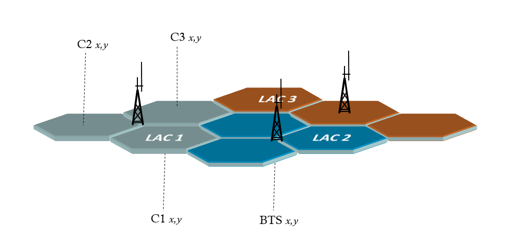
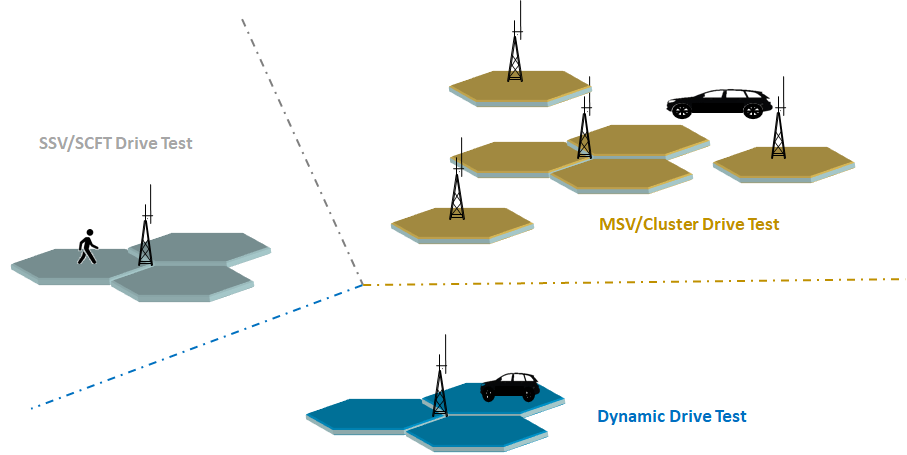
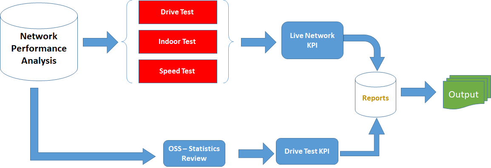
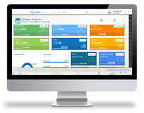
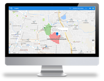
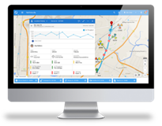

# 

### Benchmarking: A Powerful Solution for Automated Network Measurement Reporting

<figure>

</figure>

## Background

 Drive testing is a method of measuring and assessing the coverage, capacity and Quality of Service (QoS) of a mobile radio network.  The equipment are usually highly specialized electronic devices that interface to OEM mobile handsets. This ensures measurements are realistic and comparable to actual user experiences. 

<figure>

<figcaption>Figure 1: Type of Drive test</figcaption>
</figure>
 

Generate cluster drive-based report on daily basis or hourly basis as per the client requirement for QoE monitoring. Conduct cluster drive for all kind of tests like Ping test, call test, speed test, HTTP test, SMS test and Stream test and analyse the drive data for QoE monitoring.

<figure>

<figcaption>Figure 2: Analysis Drive test Process</figcaption>
</figure>
 

Single Site Verification (SSV) is an audit method, where we need to check the entire KPI (Key performance indicator), coverage and quality for a single radio base station site.

 

## Introduction

<b>Aligo</b> for Competitive Benchmarking Operators constantly need to make comparisons geographically across the country to gain a deeper understanding of their relative performance within the industry, improve operations and increase their competitive advantage. Aligo are the perfect solution as they have been purposely designed for competitive benchmarking.

<ul>
<li> Uses standard consumer smartphones to ensure results are representative and reflect the true network experience</li>  
<li> Cost effective as there is no need for expensive, specialist field measurement equipment</li> 
<li> Monitors Network Performance across all technologies (2G/3G/LTE)</li>  
<li> Transparently reports network experience benchmarks, reporting counts and durations of competing network problems, including;</li> 
<ul>
<li>NO SERVICE</li>
<li>NO DATA</li>
<li>EMERGENCY SERVICE</li>
<li>DROPPED CALLS</li>
  </ul>
  </ul>

All data measured from the Aligo is directly delivered into LivePlatform, and any user is able to filter and report facts relating to any network, by selecting the relevant operator Mobile Network Code to filter the required data. All of this functionality and reporting is readily provided within any operator Aligo project. 

<ul>
  <li>The Aligo will report location and telephony data every 10 seconds to highlight acute changes in service quality and will create a very detailed picture of the quality of network performance for major routes and territories.</li>
<li>At pre-defined intervals the Aligo will perform speed, voice and video tests and record the results at that current point. The unit will also collect location data and track its location on the map.</li>
<li>Continuous measuring, anytime, anywhere.</li>
<li>Mass collection of network performance data.</li>
<li>The data collected by the Aligo is fed back in real-time to the LivePlatform platform where the data is immediately available for analysis.</li> 
  </ul>
  
Simply inserting a SIM card for the competing network operator will allow direct comparison of network experience between different networks and can be used to give a summary of performance as well as identify individual areas of high or underperformance. Simply filter the results by MNC (Mobile Network Code) to measure several network technologies and service types to provide directly comparable information.

<ul><b>
<li>GIS view</li> 
<li>Map view</li> 
<li>Multi-technology/Multi-vendor/Multi-domain/ Multi-functionality</li> 
<li>CS/PS Support</li> 
<li>E2E Correlation</li> 
<li>Seamless End-to-End Correlation between different sources of information.</li> 
<li>Tariff accuracy checking </li>
<li>Speed test</li> 
<li>Active tests </li>
<li>Call/Data statistics</li> 
<li>Import/export to/from Google Earth 
<li>Easily mounted inside buildings</li> 
<li>Support of multi SIM card (At least 24 Sim Card) </li>
<li>Support of sim server and sim card multiplexing </li>
<li>Roaming analysis </li>
  <li>End-To-End QoE Support </li></b>
</ul>

# Operators Benchmarking

<b>Aligo</b> is being used for national benchmarking of both our customer MNOs and their competitors. The below screen shots show signal, voice and data speed/video streaming tests conducted across all major roads and big cities or small cities, for a few networks. 

<figure>

</figure>
<figure>

</figure>
<figure>

</figure>

This is a highly cost-effective and fast way to obtain accurate QoS performance data on our network available in near-real time via a secure Web Portal (Live Platform). What’s more, information can also be sourced from partner organizations including Taxi firms or Bus firms with easy to use Plug & Play test equipment.

